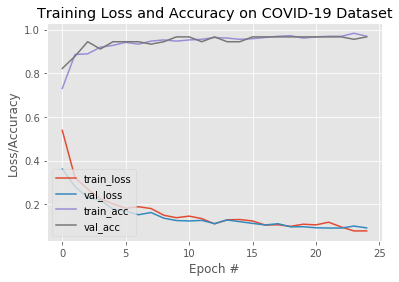
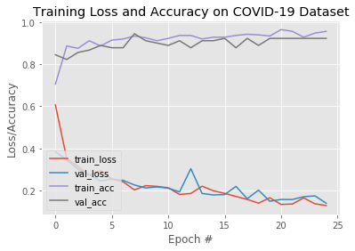
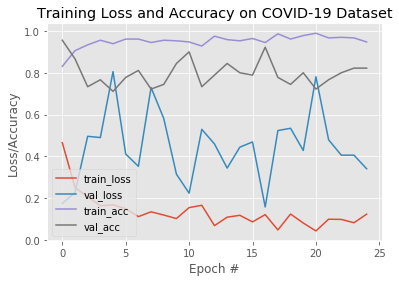
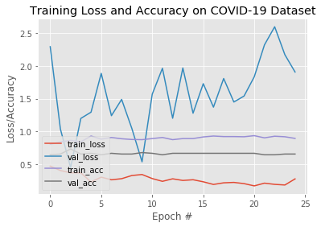
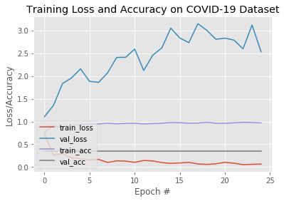
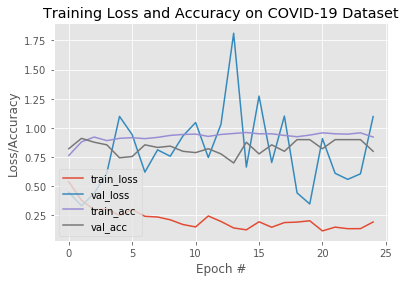

```python
# import the necessary packages
from tensorflow.keras.preprocessing.image import ImageDataGenerator
from tensorflow.keras.applications import VGG16, VGG19, InceptionV3, Xception, MobileNet, NASNetLarge, ResNet50
from tensorflow.keras.layers import AveragePooling2D
from tensorflow.keras.layers import Dropout
from tensorflow.keras.layers import Flatten
from tensorflow.keras.layers import Dense
from tensorflow.keras.layers import Input
from tensorflow.keras.models import Model
from tensorflow.keras.optimizers import Adam
from tensorflow.keras.utils import to_categorical
from sklearn.preprocessing import LabelBinarizer
from sklearn.model_selection import train_test_split
from sklearn.metrics import classification_report
from sklearn.metrics import confusion_matrix
from imutils import paths
import matplotlib.pyplot as plt
import numpy as np
import argparse
import cv2
import os
```


```python
imagePaths = list(paths.list_images("dataset"))
data = []
labels = []
```


```python
# grab the list of images in our dataset directory, then initialize
# the list of data (i.e., images) and class images
print("[INFO] loading images...")
# imagePaths = list(paths.list_images(args["dataset"]))
# data = []
# labels = []

# loop over the image paths
for imagePath in imagePaths:
	# extract the class label from the filename
	label = imagePath.split(os.path.sep)[-2]

	# load the image, swap color channels, and resize it to be a fixed
	# 224x224 pixels while ignoring aspect ratio
	image = cv2.imread(imagePath)
#	cv2.imshow('image',image)
#	cv2.waitKey(4)
#	cv2.destroyAllWindows()
	image = cv2.cvtColor(image, cv2.COLOR_BGR2RGB)
	image = cv2.resize(image, (224, 224))

	# update the data and labels lists, respectively
	data.append(image)
	labels.append(label)
```

    [INFO] loading images...


```python
# convert the data and labels to NumPy arrays while scaling the pixel
# intensities to the range [0, 255]
data = np.array(data) / 255.0
labels = np.array(labels)

# perform one-hot encoding on the labels
lb = LabelBinarizer()
labels = lb.fit_transform(labels)
labels = to_categorical(labels)

# partition the data into training and testing splits using 80% of
# the data for training and the remaining 20% for testing
(trainX, testX, trainY, testY) = train_test_split(data, labels,
	test_size=0.20, stratify=labels, random_state=42)

# initialize the training data augmentation object
trainAug = ImageDataGenerator(
	rotation_range=15,
	fill_mode="nearest")

# load the VGG16 network, ensuring the head FC layer sets are left
# off
baseModel = VGG16(weights="imagenet", include_top=False,input_tensor=Input(shape=(224, 224, 3)))

# construct the head of the model that will be placed on top of the
# the base model
headModel = baseModel.output
headModel = AveragePooling2D(pool_size=(4, 4))(headModel)
headModel = Flatten(name="flatten")(headModel)
headModel = Dense(64, activation="relu")(headModel)
headModel = Dropout(0.5)(headModel)
headModel = Dense(2, activation="softmax")(headModel)
```


```python
def model_picker(name):
#
#  """Function allows the choice of any pretrained model contained within the 
#  Keras architecture but without the top classification layers so only the 
#  bottleneck features are retained.
#
#  Args: 
#      Model name (str): The name of the desired model
#
#  Returns: 
#      Selected model
#  """
#
  if (name == 'VGG16'):
        model = VGG16(weights="imagenet", include_top=False,input_tensor=Input(shape=(224, 224, 3)))
        
  elif (name == 'VGG19'):
        model = VGG19(weights="imagenet", include_top=False,input_tensor=Input(shape=(224, 224, 3)))
        
  elif (name == 'MobileNet'):
        model = MobileNet(weights="imagenet", include_top=False,input_tensor=Input(shape=(224, 224, 3)))
        
  elif (name == 'InceptionV3'):
        model = InceptionV3(weights="imagenet", include_top=False,input_tensor=Input(shape=(224, 224, 3)))
        
  elif (name == 'ResNet50'):
        model = ResNet50(weights="imagenet", include_top=False,input_tensor=Input(shape=(224, 224, 3)))
        
  elif (name == 'Xception'):
        model = Xception(weights="imagenet", include_top=False,input_tensor=Input(shape=(224, 224, 3)))
        
  else:
        print("Specified model not available")
  return model
```


```python
model = ['VGG16','VGG19','MobileNet','InceptionV3','ResNet50','Xception']

# initialize the training data augmentation object
trainAug = ImageDataGenerator(rotation_range=15,fill_mode="nearest")

for model_str in model:
    
#    model = model_picker(model)
    
    # place the head FC model on top of the base model (this will become
    # the actual model we will train)
    
    baseModel = model_picker(model_str)
    
    headModel = baseModel.output
    headModel = AveragePooling2D(pool_size=(4, 4))(headModel)
    headModel = Flatten(name="flatten")(headModel)
    headModel = Dense(64, activation="relu")(headModel)
    headModel = Dropout(0.5)(headModel)
    headModel = Dense(2, activation="softmax")(headModel)
    
    model = Model(inputs=baseModel.input, outputs=headModel)
    
    # loop over all layers in the base model and freeze them so they will
    # *not* be updated during the first training process
    for layer in baseModel.layers:
        layer.trainable = False
        
    # compile our model
    INIT_LR = 1e-3
    EPOCHS = 25
    BS = 8
    
    print("[INFO] compiling model..."+model_str)
    opt = Adam(lr=INIT_LR, decay=INIT_LR / EPOCHS)
    model.compile(loss="binary_crossentropy", optimizer=opt,metrics=["accuracy"])
    
    # train the head of the network
    print("[INFO] training head...")
    H = model.fit_generator(
        trainAug.flow(trainX, trainY, batch_size=BS),
        steps_per_epoch=len(trainX) // BS,
        validation_data=(testX, testY),
        validation_steps=len(testX) // BS,
        epochs=EPOCHS)
    
    # make predictions on the testing set
    print("[INFO] evaluating network...")
    predIdxs = model.predict(testX, batch_size=BS)
    
    
    # for each image in the testing set we need to find the index of the
    # label with corresponding largest predicted probability
    predIdxs = np.argmax(predIdxs, axis=1)
    
    # show a nicely formatted classification report
    print(classification_report(testY.argmax(axis=1), predIdxs,target_names=lb.classes_))
    
    
    # compute the confusion matrix and and use it to derive the raw
    # accuracy, sensitivity, and specificity
    
    cm = confusion_matrix(testY.argmax(axis=1), predIdxs)
    total = sum(sum(cm))
    acc = (cm[0, 0] + cm[1, 1]) / total
    sensitivity = cm[0, 0] / (cm[0, 0] + cm[0, 1])
    specificity = cm[1, 1] / (cm[1, 0] + cm[1, 1])
    
    
    # show the confusion matrix, accuracy, sensitivity, and specificity
    print(cm)
    print("acc: {:.4f}".format(acc))
    print("sensitivity: {:.4f}".format(sensitivity))
    print("specificity: {:.4f}".format(specificity))
    
    # plot the training loss and accuracy
    N = EPOCHS
    plt.style.use("ggplot")
    plt.figure()
    plt.plot(np.arange(0, N), H.history["loss"], label="train_loss")
    plt.plot(np.arange(0, N), H.history["val_loss"], label="val_loss")
    plt.plot(np.arange(0, N), H.history["accuracy"], label="train_acc")
    plt.plot(np.arange(0, N), H.history["val_accuracy"], label="val_acc")
    plt.title("Training Loss and Accuracy on COVID-19 Dataset")
    plt.xlabel("Epoch #")
    plt.ylabel("Loss/Accuracy")
    plt.legend(loc="lower left")
    plt.savefig('plot')
    plt.show()
    
    # serialize the model to disk
    print("[INFO] saving COVID-19 detector model...")
    model.save('covid19_model_'+model_str)
```

    [INFO] compiling model...VGG16
    [INFO] training head...
    Epoch 1/25
    45/45 [==============================] - 55s 1s/step - loss: 0.5382 - accuracy: 0.7306 - val_loss: 0.3615 - val_accuracy: 0.8222
    Epoch 2/25
    45/45 [==============================] - 58s 1s/step - loss: 0.3227 - accuracy: 0.8861 - val_loss: 0.2816 - val_accuracy: 0.8778
    Epoch 3/25
    45/45 [==============================] - 56s 1s/step - loss: 0.2698 - accuracy: 0.8889 - val_loss: 0.2294 - val_accuracy: 0.9444
    Epoch 4/25
    45/45 [==============================] - 57s 1s/step - loss: 0.2250 - accuracy: 0.9194 - val_loss: 0.2197 - val_accuracy: 0.9111
    Epoch 5/25
    45/45 [==============================] - 59s 1s/step - loss: 0.2021 - accuracy: 0.9278 - val_loss: 0.1767 - val_accuracy: 0.9444
    Epoch 6/25
    45/45 [==============================] - 60s 1s/step - loss: 0.1813 - accuracy: 0.9417 - val_loss: 0.1689 - val_accuracy: 0.9444
    Epoch 7/25
    45/45 [==============================] - 57s 1s/step - loss: 0.1885 - accuracy: 0.9333 - val_loss: 0.1519 - val_accuracy: 0.9444
    Epoch 8/25
    45/45 [==============================] - 58s 1s/step - loss: 0.1804 - accuracy: 0.9472 - val_loss: 0.1621 - val_accuracy: 0.9333
    Epoch 9/25
    45/45 [==============================] - 62s 1s/step - loss: 0.1498 - accuracy: 0.9528 - val_loss: 0.1363 - val_accuracy: 0.9444
    Epoch 10/25
    45/45 [==============================] - 57s 1s/step - loss: 0.1384 - accuracy: 0.9472 - val_loss: 0.1254 - val_accuracy: 0.9667
    Epoch 11/25
    45/45 [==============================] - 58s 1s/step - loss: 0.1456 - accuracy: 0.9528 - val_loss: 0.1234 - val_accuracy: 0.9667
    Epoch 12/25
    45/45 [==============================] - 57s 1s/step - loss: 0.1343 - accuracy: 0.9556 - val_loss: 0.1261 - val_accuracy: 0.9444
    Epoch 13/25
    45/45 [==============================] - 58s 1s/step - loss: 0.1100 - accuracy: 0.9639 - val_loss: 0.1114 - val_accuracy: 0.9667
    Epoch 14/25
    45/45 [==============================] - 55s 1s/step - loss: 0.1288 - accuracy: 0.9611 - val_loss: 0.1279 - val_accuracy: 0.9444
    Epoch 15/25
    45/45 [==============================] - 59s 1s/step - loss: 0.1299 - accuracy: 0.9556 - val_loss: 0.1202 - val_accuracy: 0.9444
    Epoch 16/25
    45/45 [==============================] - 57s 1s/step - loss: 0.1234 - accuracy: 0.9583 - val_loss: 0.1124 - val_accuracy: 0.9667
    Epoch 17/25
    45/45 [==============================] - 58s 1s/step - loss: 0.1047 - accuracy: 0.9639 - val_loss: 0.1051 - val_accuracy: 0.9667
    Epoch 18/25
    45/45 [==============================] - 58s 1s/step - loss: 0.1060 - accuracy: 0.9694 - val_loss: 0.1109 - val_accuracy: 0.9667
    Epoch 19/25
    45/45 [==============================] - 58s 1s/step - loss: 0.0989 - accuracy: 0.9722 - val_loss: 0.0965 - val_accuracy: 0.9667
    Epoch 20/25
    45/45 [==============================] - 59s 1s/step - loss: 0.1085 - accuracy: 0.9611 - val_loss: 0.0970 - val_accuracy: 0.9667
    Epoch 21/25
    45/45 [==============================] - 59s 1s/step - loss: 0.1055 - accuracy: 0.9667 - val_loss: 0.0922 - val_accuracy: 0.9667
    Epoch 22/25
    45/45 [==============================] - 59s 1s/step - loss: 0.1177 - accuracy: 0.9694 - val_loss: 0.0910 - val_accuracy: 0.9667
    Epoch 23/25
    45/45 [==============================] - 57s 1s/step - loss: 0.0957 - accuracy: 0.9694 - val_loss: 0.0910 - val_accuracy: 0.9667
    Epoch 24/25
    45/45 [==============================] - 55s 1s/step - loss: 0.0779 - accuracy: 0.9833 - val_loss: 0.1001 - val_accuracy: 0.9556
    Epoch 25/25
    45/45 [==============================] - 56s 1s/step - loss: 0.0779 - accuracy: 0.9694 - val_loss: 0.0916 - val_accuracy: 0.9667
    [INFO] evaluating network...
                  precision    recall  f1-score   support
    
           covid       0.94      0.97      0.95        32
          normal       0.98      0.97      0.97        58
    
       micro avg       0.97      0.97      0.97        90
       macro avg       0.96      0.97      0.96        90
    weighted avg       0.97      0.97      0.97        90
    
    [[31  1]
     [ 2 56]]
    acc: 0.9667
    sensitivity: 0.9688
    specificity: 0.9655





    [INFO] saving COVID-19 detector model...
    [INFO] compiling model...VGG19
    [INFO] training head...
    Epoch 1/25
    45/45 [==============================] - 74s 2s/step - loss: 0.6062 - accuracy: 0.7056 - val_loss: 0.3842 - val_accuracy: 0.8444
    Epoch 2/25
    45/45 [==============================] - 73s 2s/step - loss: 0.3522 - accuracy: 0.8861 - val_loss: 0.3465 - val_accuracy: 0.8222
    Epoch 3/25
    45/45 [==============================] - 70s 2s/step - loss: 0.3152 - accuracy: 0.8750 - val_loss: 0.3022 - val_accuracy: 0.8556
    Epoch 4/25
    45/45 [==============================] - 70s 2s/step - loss: 0.2731 - accuracy: 0.9111 - val_loss: 0.2763 - val_accuracy: 0.8667
    Epoch 5/25
    45/45 [==============================] - 72s 2s/step - loss: 0.2956 - accuracy: 0.8861 - val_loss: 0.2457 - val_accuracy: 0.8889
    Epoch 6/25
    45/45 [==============================] - 70s 2s/step - loss: 0.2549 - accuracy: 0.9139 - val_loss: 0.2557 - val_accuracy: 0.8778
    Epoch 7/25
    45/45 [==============================] - 77s 2s/step - loss: 0.2424 - accuracy: 0.9194 - val_loss: 0.2489 - val_accuracy: 0.8778
    Epoch 8/25
    45/45 [==============================] - 76s 2s/step - loss: 0.2037 - accuracy: 0.9333 - val_loss: 0.2271 - val_accuracy: 0.9444
    Epoch 9/25
    45/45 [==============================] - 76s 2s/step - loss: 0.2239 - accuracy: 0.9250 - val_loss: 0.2130 - val_accuracy: 0.9111
    Epoch 10/25
    45/45 [==============================] - 74s 2s/step - loss: 0.2205 - accuracy: 0.9111 - val_loss: 0.2178 - val_accuracy: 0.9000
    Epoch 11/25
    45/45 [==============================] - 74s 2s/step - loss: 0.2137 - accuracy: 0.9222 - val_loss: 0.2120 - val_accuracy: 0.8889
    Epoch 12/25
    45/45 [==============================] - 73s 2s/step - loss: 0.1821 - accuracy: 0.9361 - val_loss: 0.1943 - val_accuracy: 0.9111
    Epoch 13/25
    45/45 [==============================] - 69s 2s/step - loss: 0.1868 - accuracy: 0.9361 - val_loss: 0.3043 - val_accuracy: 0.8778
    Epoch 14/25
    45/45 [==============================] - 69s 2s/step - loss: 0.2213 - accuracy: 0.9194 - val_loss: 0.1867 - val_accuracy: 0.9111
    Epoch 15/25
    45/45 [==============================] - 76s 2s/step - loss: 0.1998 - accuracy: 0.9278 - val_loss: 0.1798 - val_accuracy: 0.9111
    Epoch 16/25
    45/45 [==============================] - 73s 2s/step - loss: 0.1872 - accuracy: 0.9278 - val_loss: 0.1816 - val_accuracy: 0.9222
    Epoch 17/25
    45/45 [==============================] - 72s 2s/step - loss: 0.1727 - accuracy: 0.9361 - val_loss: 0.2204 - val_accuracy: 0.8778
    Epoch 18/25
    45/45 [==============================] - 74s 2s/step - loss: 0.1586 - accuracy: 0.9417 - val_loss: 0.1622 - val_accuracy: 0.9222
    Epoch 19/25
    45/45 [==============================] - 70s 2s/step - loss: 0.1408 - accuracy: 0.9389 - val_loss: 0.2026 - val_accuracy: 0.8889
    Epoch 20/25
    45/45 [==============================] - 70s 2s/step - loss: 0.1665 - accuracy: 0.9333 - val_loss: 0.1500 - val_accuracy: 0.9222
    Epoch 21/25
    45/45 [==============================] - 71s 2s/step - loss: 0.1347 - accuracy: 0.9639 - val_loss: 0.1585 - val_accuracy: 0.9222
    Epoch 22/25
    45/45 [==============================] - 77s 2s/step - loss: 0.1368 - accuracy: 0.9556 - val_loss: 0.1583 - val_accuracy: 0.9222
    Epoch 23/25
    45/45 [==============================] - 74s 2s/step - loss: 0.1659 - accuracy: 0.9278 - val_loss: 0.1714 - val_accuracy: 0.9222
    Epoch 24/25
    45/45 [==============================] - 81s 2s/step - loss: 0.1378 - accuracy: 0.9472 - val_loss: 0.1753 - val_accuracy: 0.9222
    Epoch 25/25
    45/45 [==============================] - 73s 2s/step - loss: 0.1296 - accuracy: 0.9556 - val_loss: 0.1405 - val_accuracy: 0.9222
    [INFO] evaluating network...
                  precision    recall  f1-score   support
    
           covid       0.93      0.84      0.89        32
          normal       0.92      0.97      0.94        58
    
       micro avg       0.92      0.92      0.92        90
       macro avg       0.92      0.90      0.91        90
    weighted avg       0.92      0.92      0.92        90
    
    [[27  5]
     [ 2 56]]
    acc: 0.9222
    sensitivity: 0.8438
    specificity: 0.9655





    [INFO] saving COVID-19 detector model...


    /anaconda3/lib/python3.6/site-packages/keras_applications/mobilenet.py:207: UserWarning: MobileNet shape is undefined. Weights for input shape (224, 224) will be loaded.
      warnings.warn('MobileNet shape is undefined.'


    [INFO] compiling model...MobileNet
    [INFO] training head...
    Epoch 1/25
    45/45 [==============================] - 15s 343ms/step - loss: 0.4660 - accuracy: 0.8306 - val_loss: 0.1760 - val_accuracy: 0.9556
    Epoch 2/25
    45/45 [==============================] - 13s 295ms/step - loss: 0.2521 - accuracy: 0.9056 - val_loss: 0.2277 - val_accuracy: 0.8667
    Epoch 3/25
    45/45 [==============================] - 13s 295ms/step - loss: 0.2069 - accuracy: 0.9333 - val_loss: 0.4965 - val_accuracy: 0.7333
    Epoch 4/25
    45/45 [==============================] - 13s 298ms/step - loss: 0.1647 - accuracy: 0.9556 - val_loss: 0.4905 - val_accuracy: 0.7667
    Epoch 5/25
    45/45 [==============================] - 14s 313ms/step - loss: 0.1691 - accuracy: 0.9389 - val_loss: 0.8056 - val_accuracy: 0.7111
    Epoch 6/25
    45/45 [==============================] - 13s 298ms/step - loss: 0.1506 - accuracy: 0.9611 - val_loss: 0.4119 - val_accuracy: 0.7778
    Epoch 7/25
    45/45 [==============================] - 12s 277ms/step - loss: 0.1127 - accuracy: 0.9611 - val_loss: 0.3530 - val_accuracy: 0.8111
    Epoch 8/25
    45/45 [==============================] - 13s 280ms/step - loss: 0.1356 - accuracy: 0.9444 - val_loss: 0.7295 - val_accuracy: 0.7222
    Epoch 9/25
    45/45 [==============================] - 13s 284ms/step - loss: 0.1203 - accuracy: 0.9556 - val_loss: 0.5817 - val_accuracy: 0.7444
    Epoch 10/25
    45/45 [==============================] - 12s 270ms/step - loss: 0.1034 - accuracy: 0.9528 - val_loss: 0.3156 - val_accuracy: 0.8444
    Epoch 11/25
    45/45 [==============================] - 13s 296ms/step - loss: 0.1558 - accuracy: 0.9472 - val_loss: 0.2247 - val_accuracy: 0.9000
    Epoch 12/25
    45/45 [==============================] - 12s 273ms/step - loss: 0.1668 - accuracy: 0.9278 - val_loss: 0.5297 - val_accuracy: 0.7333
    Epoch 13/25
    45/45 [==============================] - 13s 290ms/step - loss: 0.0697 - accuracy: 0.9750 - val_loss: 0.4600 - val_accuracy: 0.7889
    Epoch 14/25
    45/45 [==============================] - 13s 286ms/step - loss: 0.1100 - accuracy: 0.9583 - val_loss: 0.3446 - val_accuracy: 0.8444
    Epoch 15/25
    45/45 [==============================] - 13s 282ms/step - loss: 0.1190 - accuracy: 0.9528 - val_loss: 0.4446 - val_accuracy: 0.8000
    Epoch 16/25
    45/45 [==============================] - 12s 274ms/step - loss: 0.0876 - accuracy: 0.9639 - val_loss: 0.4695 - val_accuracy: 0.7889
    Epoch 17/25
    45/45 [==============================] - 13s 281ms/step - loss: 0.1223 - accuracy: 0.9444 - val_loss: 0.1588 - val_accuracy: 0.9222
    Epoch 18/25
    45/45 [==============================] - 12s 277ms/step - loss: 0.0490 - accuracy: 0.9861 - val_loss: 0.5239 - val_accuracy: 0.7778
    Epoch 19/25
    45/45 [==============================] - 13s 281ms/step - loss: 0.1251 - accuracy: 0.9611 - val_loss: 0.5349 - val_accuracy: 0.7444
    Epoch 20/25
    45/45 [==============================] - 14s 308ms/step - loss: 0.0821 - accuracy: 0.9778 - val_loss: 0.4287 - val_accuracy: 0.8000
    Epoch 21/25
    45/45 [==============================] - 13s 281ms/step - loss: 0.0444 - accuracy: 0.9889 - val_loss: 0.7811 - val_accuracy: 0.7222
    Epoch 22/25
    45/45 [==============================] - 13s 282ms/step - loss: 0.1004 - accuracy: 0.9667 - val_loss: 0.4797 - val_accuracy: 0.7667
    Epoch 23/25
    45/45 [==============================] - 13s 283ms/step - loss: 0.0994 - accuracy: 0.9694 - val_loss: 0.4063 - val_accuracy: 0.8000
    Epoch 24/25
    45/45 [==============================] - 13s 278ms/step - loss: 0.0835 - accuracy: 0.9667 - val_loss: 0.4063 - val_accuracy: 0.8222
    Epoch 25/25
    45/45 [==============================] - 13s 283ms/step - loss: 0.1245 - accuracy: 0.9472 - val_loss: 0.3412 - val_accuracy: 0.8222
    [INFO] evaluating network...
                  precision    recall  f1-score   support
    
           covid       1.00      0.50      0.67        32
          normal       0.78      1.00      0.88        58
    
       micro avg       0.82      0.82      0.82        90
       macro avg       0.89      0.75      0.77        90
    weighted avg       0.86      0.82      0.80        90
    
    [[16 16]
     [ 0 58]]
    acc: 0.8222
    sensitivity: 0.5000
    specificity: 1.0000





    [INFO] saving COVID-19 detector model...
    [INFO] compiling model...InceptionV3
    [INFO] training head...
    Epoch 1/25
    45/45 [==============================] - 24s 522ms/step - loss: 0.4708 - accuracy: 0.8028 - val_loss: 2.2949 - val_accuracy: 0.6444
    Epoch 2/25
    45/45 [==============================] - 23s 516ms/step - loss: 0.4038 - accuracy: 0.8417 - val_loss: 1.0362 - val_accuracy: 0.6556
    Epoch 3/25
    45/45 [==============================] - 23s 505ms/step - loss: 0.3698 - accuracy: 0.8639 - val_loss: 0.4486 - val_accuracy: 0.7333
    Epoch 4/25
    45/45 [==============================] - 21s 467ms/step - loss: 0.3689 - accuracy: 0.8417 - val_loss: 1.1995 - val_accuracy: 0.6556
    Epoch 5/25
    45/45 [==============================] - 23s 506ms/step - loss: 0.2298 - accuracy: 0.9306 - val_loss: 1.2948 - val_accuracy: 0.6667
    Epoch 6/25
    45/45 [==============================] - 23s 518ms/step - loss: 0.3024 - accuracy: 0.8833 - val_loss: 1.8875 - val_accuracy: 0.6444
    Epoch 7/25
    45/45 [==============================] - 26s 568ms/step - loss: 0.2625 - accuracy: 0.9083 - val_loss: 1.2412 - val_accuracy: 0.6667
    Epoch 8/25
    45/45 [==============================] - 24s 533ms/step - loss: 0.2792 - accuracy: 0.8889 - val_loss: 1.4896 - val_accuracy: 0.6556
    Epoch 9/25
    45/45 [==============================] - 24s 526ms/step - loss: 0.3276 - accuracy: 0.8778 - val_loss: 1.0466 - val_accuracy: 0.6556
    Epoch 10/25
    45/45 [==============================] - 24s 525ms/step - loss: 0.3430 - accuracy: 0.8750 - val_loss: 0.5371 - val_accuracy: 0.6778
    Epoch 11/25
    45/45 [==============================] - 25s 557ms/step - loss: 0.2812 - accuracy: 0.8917 - val_loss: 1.5700 - val_accuracy: 0.6667
    Epoch 12/25
    45/45 [==============================] - 23s 518ms/step - loss: 0.2389 - accuracy: 0.9083 - val_loss: 1.9650 - val_accuracy: 0.6444
    Epoch 13/25
    45/45 [==============================] - 25s 564ms/step - loss: 0.2773 - accuracy: 0.8750 - val_loss: 1.2021 - val_accuracy: 0.6667
    Epoch 14/25
    45/45 [==============================] - 27s 593ms/step - loss: 0.2524 - accuracy: 0.8917 - val_loss: 1.9696 - val_accuracy: 0.6667
    Epoch 15/25
    45/45 [==============================] - 26s 567ms/step - loss: 0.2631 - accuracy: 0.8917 - val_loss: 1.2790 - val_accuracy: 0.6667
    Epoch 16/25
    45/45 [==============================] - 26s 567ms/step - loss: 0.2318 - accuracy: 0.9167 - val_loss: 1.7298 - val_accuracy: 0.6667
    Epoch 17/25
    45/45 [==============================] - 22s 489ms/step - loss: 0.1912 - accuracy: 0.9306 - val_loss: 1.3718 - val_accuracy: 0.6667
    Epoch 18/25
    45/45 [==============================] - 24s 525ms/step - loss: 0.2159 - accuracy: 0.9222 - val_loss: 1.8087 - val_accuracy: 0.6667
    Epoch 19/25
    45/45 [==============================] - 25s 555ms/step - loss: 0.2224 - accuracy: 0.9222 - val_loss: 1.4498 - val_accuracy: 0.6667
    Epoch 20/25
    45/45 [==============================] - 23s 505ms/step - loss: 0.2039 - accuracy: 0.9194 - val_loss: 1.5413 - val_accuracy: 0.6667
    Epoch 21/25
    45/45 [==============================] - 22s 484ms/step - loss: 0.1694 - accuracy: 0.9361 - val_loss: 1.8355 - val_accuracy: 0.6667
    Epoch 22/25
    45/45 [==============================] - 22s 489ms/step - loss: 0.2111 - accuracy: 0.9028 - val_loss: 2.3228 - val_accuracy: 0.6444
    Epoch 23/25
    45/45 [==============================] - 24s 537ms/step - loss: 0.1925 - accuracy: 0.9278 - val_loss: 2.5989 - val_accuracy: 0.6444
    Epoch 24/25
    45/45 [==============================] - 22s 495ms/step - loss: 0.1828 - accuracy: 0.9194 - val_loss: 2.1720 - val_accuracy: 0.6556
    Epoch 25/25
    45/45 [==============================] - 22s 483ms/step - loss: 0.2763 - accuracy: 0.8944 - val_loss: 1.9073 - val_accuracy: 0.6556
    [INFO] evaluating network...
                  precision    recall  f1-score   support
    
           covid       1.00      0.03      0.06        32
          normal       0.65      1.00      0.79        58
    
       micro avg       0.66      0.66      0.66        90
       macro avg       0.83      0.52      0.42        90
    weighted avg       0.78      0.66      0.53        90
    
    [[ 1 31]
     [ 0 58]]
    acc: 0.6556
    sensitivity: 0.0312
    specificity: 1.0000





    [INFO] saving COVID-19 detector model...


    /anaconda3/lib/python3.6/site-packages/keras_applications/resnet50.py:265: UserWarning: The output shape of `ResNet50(include_top=False)` has been changed since Keras 2.2.0.
      warnings.warn('The output shape of `ResNet50(include_top=False)` '


    [INFO] compiling model...ResNet50
    [INFO] training head...
    Epoch 1/25
    45/45 [==============================] - 47s 1s/step - loss: 0.7296 - accuracy: 0.7639 - val_loss: 1.1052 - val_accuracy: 0.3556
    Epoch 2/25
    45/45 [==============================] - 47s 1s/step - loss: 0.2623 - accuracy: 0.9028 - val_loss: 1.3546 - val_accuracy: 0.3556
    Epoch 3/25
    45/45 [==============================] - 43s 965ms/step - loss: 0.2972 - accuracy: 0.8722 - val_loss: 1.8326 - val_accuracy: 0.3556
    Epoch 4/25
    45/45 [==============================] - 44s 986ms/step - loss: 0.2035 - accuracy: 0.9167 - val_loss: 1.9569 - val_accuracy: 0.3556
    Epoch 5/25
    45/45 [==============================] - 43s 951ms/step - loss: 0.1827 - accuracy: 0.9333 - val_loss: 2.1565 - val_accuracy: 0.3556
    Epoch 6/25
    45/45 [==============================] - 41s 917ms/step - loss: 0.1570 - accuracy: 0.9389 - val_loss: 1.8814 - val_accuracy: 0.3556
    Epoch 7/25
    45/45 [==============================] - 44s 975ms/step - loss: 0.1700 - accuracy: 0.9472 - val_loss: 1.8590 - val_accuracy: 0.3556
    Epoch 8/25
    45/45 [==============================] - 40s 885ms/step - loss: 0.1018 - accuracy: 0.9639 - val_loss: 2.0692 - val_accuracy: 0.3556
    Epoch 9/25
    45/45 [==============================] - 42s 943ms/step - loss: 0.1381 - accuracy: 0.9500 - val_loss: 2.4059 - val_accuracy: 0.3556
    Epoch 10/25
    45/45 [==============================] - 41s 918ms/step - loss: 0.1316 - accuracy: 0.9583 - val_loss: 2.4097 - val_accuracy: 0.3556
    Epoch 11/25
    45/45 [==============================] - 40s 879ms/step - loss: 0.1051 - accuracy: 0.9639 - val_loss: 2.5889 - val_accuracy: 0.3556
    Epoch 12/25
    45/45 [==============================] - 44s 971ms/step - loss: 0.1456 - accuracy: 0.9472 - val_loss: 2.1212 - val_accuracy: 0.3556
    Epoch 13/25
    45/45 [==============================] - 42s 927ms/step - loss: 0.1355 - accuracy: 0.9556 - val_loss: 2.4562 - val_accuracy: 0.3556
    Epoch 14/25
    45/45 [==============================] - 44s 982ms/step - loss: 0.0995 - accuracy: 0.9639 - val_loss: 2.6142 - val_accuracy: 0.3556
    Epoch 15/25
    45/45 [==============================] - 45s 1s/step - loss: 0.0822 - accuracy: 0.9778 - val_loss: 3.0488 - val_accuracy: 0.3556
    Epoch 16/25
    45/45 [==============================] - 45s 992ms/step - loss: 0.0917 - accuracy: 0.9750 - val_loss: 2.8325 - val_accuracy: 0.3556
    Epoch 17/25
    45/45 [==============================] - 44s 980ms/step - loss: 0.1051 - accuracy: 0.9639 - val_loss: 2.7307 - val_accuracy: 0.3556
    Epoch 18/25
    45/45 [==============================] - 46s 1s/step - loss: 0.0695 - accuracy: 0.9667 - val_loss: 3.1466 - val_accuracy: 0.3556
    Epoch 19/25
    45/45 [==============================] - 45s 995ms/step - loss: 0.0601 - accuracy: 0.9833 - val_loss: 2.9995 - val_accuracy: 0.3556
    Epoch 20/25
    45/45 [==============================] - 45s 993ms/step - loss: 0.0737 - accuracy: 0.9639 - val_loss: 2.8053 - val_accuracy: 0.3556
    Epoch 21/25
    45/45 [==============================] - 44s 975ms/step - loss: 0.1050 - accuracy: 0.9639 - val_loss: 2.8294 - val_accuracy: 0.3556
    Epoch 22/25
    45/45 [==============================] - 47s 1s/step - loss: 0.0859 - accuracy: 0.9722 - val_loss: 2.7873 - val_accuracy: 0.3556
    Epoch 23/25
    45/45 [==============================] - 42s 924ms/step - loss: 0.0555 - accuracy: 0.9833 - val_loss: 2.5958 - val_accuracy: 0.3556
    Epoch 24/25
    45/45 [==============================] - 42s 925ms/step - loss: 0.0619 - accuracy: 0.9778 - val_loss: 3.1163 - val_accuracy: 0.3556
    Epoch 25/25
    45/45 [==============================] - 44s 985ms/step - loss: 0.0684 - accuracy: 0.9694 - val_loss: 2.5325 - val_accuracy: 0.3556
    [INFO] evaluating network...


    /anaconda3/lib/python3.6/site-packages/sklearn/metrics/classification.py:1143: UndefinedMetricWarning: Precision and F-score are ill-defined and being set to 0.0 in labels with no predicted samples.
      'precision', 'predicted', average, warn_for)


                  precision    recall  f1-score   support
    
           covid       0.36      1.00      0.52        32
          normal       0.00      0.00      0.00        58
    
       micro avg       0.36      0.36      0.36        90
       macro avg       0.18      0.50      0.26        90
    weighted avg       0.13      0.36      0.19        90
    
    [[32  0]
     [58  0]]
    acc: 0.3556
    sensitivity: 1.0000
    specificity: 0.0000





    [INFO] saving COVID-19 detector model...
    [INFO] compiling model...Xception
    [INFO] training head...
    Epoch 1/25
    45/45 [==============================] - 61s 1s/step - loss: 0.5385 - accuracy: 0.7639 - val_loss: 0.4496 - val_accuracy: 0.8222
    Epoch 2/25
    45/45 [==============================] - 54s 1s/step - loss: 0.3811 - accuracy: 0.8806 - val_loss: 0.3335 - val_accuracy: 0.9111
    Epoch 3/25
    45/45 [==============================] - 52s 1s/step - loss: 0.2982 - accuracy: 0.9222 - val_loss: 0.4395 - val_accuracy: 0.8778
    Epoch 4/25
    45/45 [==============================] - 47s 1s/step - loss: 0.3037 - accuracy: 0.8917 - val_loss: 0.6142 - val_accuracy: 0.8556
    Epoch 5/25
    45/45 [==============================] - 55s 1s/step - loss: 0.2515 - accuracy: 0.9111 - val_loss: 1.0991 - val_accuracy: 0.7444
    Epoch 6/25
    45/45 [==============================] - 57s 1s/step - loss: 0.3006 - accuracy: 0.9167 - val_loss: 0.9420 - val_accuracy: 0.7556
    Epoch 7/25
    45/45 [==============================] - 58s 1s/step - loss: 0.2430 - accuracy: 0.9083 - val_loss: 0.6218 - val_accuracy: 0.8556
    Epoch 8/25
    45/45 [==============================] - 54s 1s/step - loss: 0.2371 - accuracy: 0.9194 - val_loss: 0.8126 - val_accuracy: 0.8333
    Epoch 9/25
    45/45 [==============================] - 50s 1s/step - loss: 0.2132 - accuracy: 0.9361 - val_loss: 0.7578 - val_accuracy: 0.8444
    Epoch 10/25
    45/45 [==============================] - 53s 1s/step - loss: 0.1725 - accuracy: 0.9444 - val_loss: 0.9310 - val_accuracy: 0.8000
    Epoch 11/25
    45/45 [==============================] - 52s 1s/step - loss: 0.1521 - accuracy: 0.9472 - val_loss: 1.0466 - val_accuracy: 0.7889
    Epoch 12/25
    45/45 [==============================] - 50s 1s/step - loss: 0.2458 - accuracy: 0.9278 - val_loss: 0.7469 - val_accuracy: 0.8222
    Epoch 13/25
    45/45 [==============================] - 50s 1s/step - loss: 0.1989 - accuracy: 0.9444 - val_loss: 1.0314 - val_accuracy: 0.7778
    Epoch 14/25
    45/45 [==============================] - 51s 1s/step - loss: 0.1433 - accuracy: 0.9528 - val_loss: 1.8116 - val_accuracy: 0.7000
    Epoch 15/25
    45/45 [==============================] - 47s 1s/step - loss: 0.1272 - accuracy: 0.9611 - val_loss: 0.6650 - val_accuracy: 0.8778
    Epoch 16/25
    45/45 [==============================] - 52s 1s/step - loss: 0.1960 - accuracy: 0.9500 - val_loss: 1.2732 - val_accuracy: 0.7778
    Epoch 17/25
    45/45 [==============================] - 54s 1s/step - loss: 0.1494 - accuracy: 0.9500 - val_loss: 0.7042 - val_accuracy: 0.8556
    Epoch 18/25
    45/45 [==============================] - 50s 1s/step - loss: 0.1894 - accuracy: 0.9361 - val_loss: 1.1018 - val_accuracy: 0.8000
    Epoch 19/25
    45/45 [==============================] - 50s 1s/step - loss: 0.1935 - accuracy: 0.9250 - val_loss: 0.4438 - val_accuracy: 0.9000
    Epoch 20/25
    45/45 [==============================] - 47s 1s/step - loss: 0.2048 - accuracy: 0.9389 - val_loss: 0.3488 - val_accuracy: 0.9000
    Epoch 21/25
    45/45 [==============================] - 51s 1s/step - loss: 0.1179 - accuracy: 0.9583 - val_loss: 0.9092 - val_accuracy: 0.8222
    Epoch 22/25
    45/45 [==============================] - 50s 1s/step - loss: 0.1503 - accuracy: 0.9500 - val_loss: 0.6115 - val_accuracy: 0.9000
    Epoch 23/25
    45/45 [==============================] - 57s 1s/step - loss: 0.1370 - accuracy: 0.9472 - val_loss: 0.5596 - val_accuracy: 0.9000
    Epoch 24/25
    45/45 [==============================] - 50s 1s/step - loss: 0.1374 - accuracy: 0.9583 - val_loss: 0.6073 - val_accuracy: 0.9000
    Epoch 25/25
    45/45 [==============================] - 52s 1s/step - loss: 0.1944 - accuracy: 0.9222 - val_loss: 1.0979 - val_accuracy: 0.8000
    [INFO] evaluating network...
                  precision    recall  f1-score   support
    
           covid       1.00      0.44      0.61        32
          normal       0.76      1.00      0.87        58
    
       micro avg       0.80      0.80      0.80        90
       macro avg       0.88      0.72      0.74        90
    weighted avg       0.85      0.80      0.77        90
    
    [[14 18]
     [ 0 58]]
    acc: 0.8000
    sensitivity: 0.4375
    specificity: 1.0000





    [INFO] saving COVID-19 detector model...


```python

```
